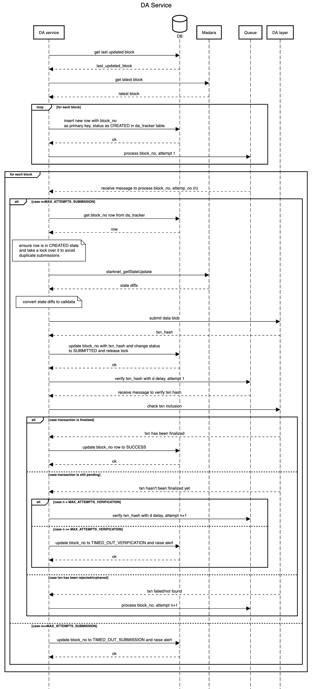

# Madara Orchestrator

The Madara orchestrator is designed to be an additional service which runs in
parallel to Madara and handles

1. publishing data to the respective DA layer
2. running SNOS and submitting jobs to the prover
3. updating the state on Cairo core contracts

The tentative flow of the orchestrator looks like this but this is subject to change as we
learn more about external systems and the constratins involved.

