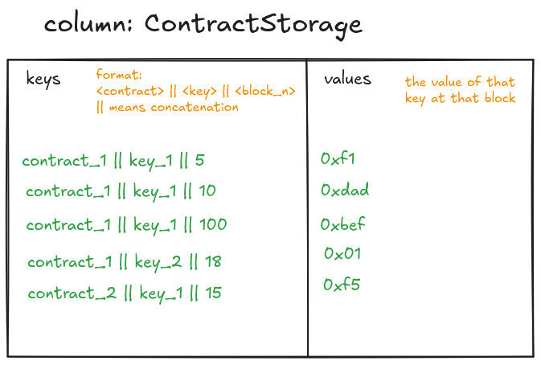
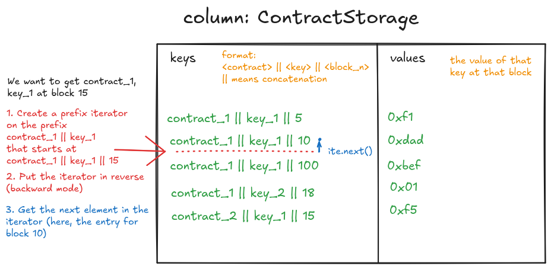

# Key value flat storage

We are interested in the operation `get_storage_at(block_id, contract_address, storage_key) -> value` here.
Bonsai-trie does not have an history of the key-values, it only has a flat storage for the latest state.
We may want to remove that flat storage from bonsai-trie as it's not used and we don't plan on using it.

Instead, we have implemented our own optimized lookup, which is implemented with a column that looks like this:

The trick here is to rely on the fact that rocksdb columns are sorted trees.
The rocksdb `get` operation does not allow getting the value of (contract_1, key_1) at block 15 here, because
the key has not been modified at that block.
Instead, we use rocksdb iterators.

This allows us to get the most recent value for a (contract, key) at that block, by using a single rocksdb lookup.

In addition, we also set up a [rocksdb prefix extractor](https://github.com/facebook/rocksdb/wiki/Prefix-Seek) for
that column, so that rocksdb can know
to treat the `<contract> || <key>` part differently from the block_n part, which allows optimisations.

## Other columns

We also use this exact technique to store contract class hash history and contract nonce history - so that we're
able to quickly get the nonce/class hash of a
contract at a specific block.
