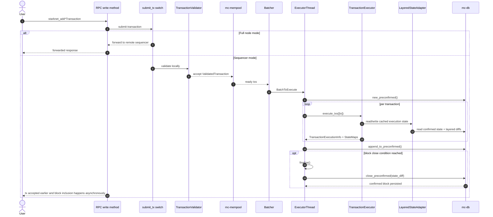
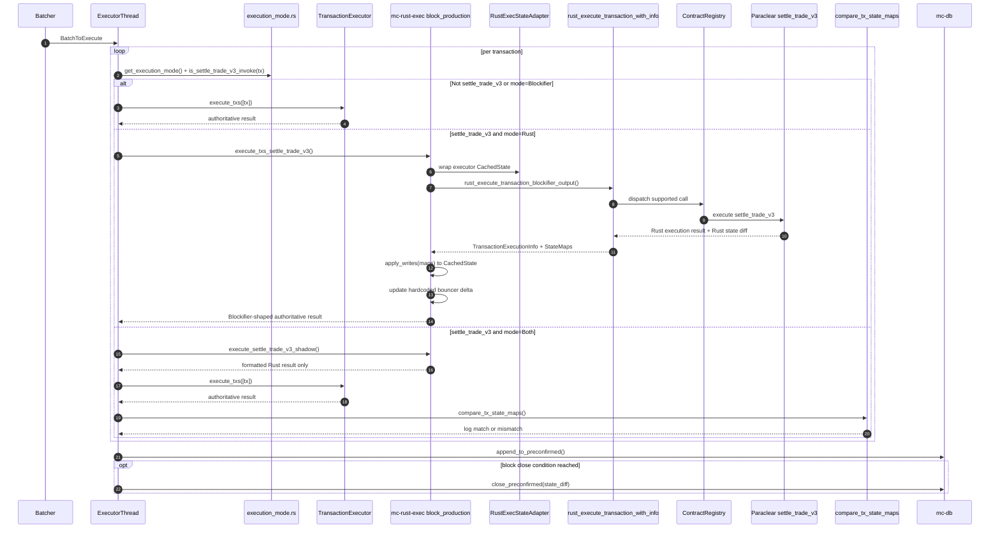

# Madara Transaction Flow With Rust-Exec

This checkout keeps the standard Madara transaction pipeline up to block execution, then adds a targeted alternate execution path
for Paraclear `settle_trade_v3` calls.

The important point is that this is not a second sequencer pipeline. RPC ingress, validation, mempooling, batching,
preconfirmed block handling, and final block close still follow the usual Madara design. The new logic starts inside the
executor thread and only for a narrow subset of `Invoke` transactions.

The contract logic behind that alternate path is now aligned with `paraclear_1_25_1`. This document stays focused on routing,
state integration, and tracing rather than on the full trade-matching semantics.

## Scope

Shared with normal Madara:

- RPC write ingress
- forward-vs-sequence submit switch
- local validation with Blockifier
- mempool admission
- batch assembly
- preconfirmed block append
- confirmed block close

Added in this checkout:

- `mc-rust-exec` crate
- per-transaction execution routing in `mc-block-production`
- authoritative Rust execution mode for `settle_trade_v3`
- shadow compare mode (`Both`)
- `traceTransactionRust` RPC

## Normal Flow

This is the baseline Madara path.

## New Rust-Exec Flow

The shared pipeline stays the same until the executor thread receives a batch. At that point, each tx is classified independently.

## What Actually Changed

<!-- markdownlint-disable MD013 -->

| Area | Normal flow | New flow in this checkout |
|---|---|---|
| Routing point | No per-tx routing. Batch goes straight to Blockifier. | Executor thread classifies each tx and may reroute only `settle_trade_v3`. |
| Eligible txs | All txs use Blockifier. | Non-`settle_trade_v3` txs still use Blockifier. Only matching `Invoke` txs can use Rust. |
| Execution backend | Blockifier executes directly over `TransactionExecutor<LayeredStateAdapter>`. | Rust path executes over `RustExecStateAdapter`, which reads the executor's cached state. |
| Read path | `Blockifier -> LayeredStateAdapter -> DB/layered caches`. | `rust-exec -> RustExecStateAdapter -> CachedState<LayeredStateAdapter> -> DB/layered caches`. |
| Write path | Blockifier mutates executor cached state directly. | Rust path computes `StateMaps`, then applies them back into Blockifier cached state with `apply_writes`. |
| Result format | Native Blockifier `TransactionExecutionInfo + StateMaps`. | Rust outcome is converted back into the same Blockifier-native shape before the outer pipeline sees it. |
| Bouncer / resources | Native Blockifier accounting. | `settle_trade_v3` still uses rust-exec integration constants for the Blockifier-shaped receipt/resource envelope and empirical bouncer gas profiles. The trade's own fee debits, credits, and fee events come from current Paraclear/AssetsManager state. |
| Compare mode | None. | `Both` runs Rust shadow first, then Blockifier authoritative, and only logs parity results. |
| Trace RPC | `traceTransaction` reexecutes and traces via Blockifier. | `traceTransactionRust` replays prior txs with Blockifier, then runs the target tx through rust-exec and builds an RPC trace from Rust call info. |
| Final block creation | `append_to_preconfirmed` then `close_preconfirmed`. | Same. Block persistence is unchanged because Rust returns Blockifier-shaped outputs. |

<!-- markdownlint-enable MD013 -->

## How The New Execution Path Works

### 1. Mode selection is runtime-configured

`crates/client/block_production/src/execution_mode.rs` reads `TX_EXECUTOR_MODE` or `TX_EXECUTION_MODE` once and caches the
result. Supported modes are:

- `Blockifier`
- `Rust`
- `Both`

The default remains `Blockifier`.

### 2. Only `settle_trade_v3` is intercepted

`is_settle_trade_v3_invoke(tx)` parses account calldata and looks for the `settle_trade_v3` selector. If that check fails, the
tx always falls back to the normal Blockifier path.

So the new feature is selective, not global.

### 3. Rust execution still runs against the executor's live block state

In authoritative Rust mode, `execute_txs_settle_trade_v3()`:

1. takes the executor's `block_state`
2. wraps it in `RustExecStateAdapter`
3. runs `rust_execute_transaction_blockifier_output()`
4. converts the Rust result into `TransactionExecutionInfo + StateMaps`
5. applies those writes back into the Blockifier cached state
6. updates the bouncer with a Rust-specific delta

That means the rest of block production still sees a normal Blockifier-like result and does not need a separate persistence path.

### 4. Internal Rust dispatch is contract-aware

Inside `mc-rust-exec`, the path is roughly:

1. parse account calldata into calls
2. identify supported contracts and selectors through `ContractRegistry`
3. execute Paraclear logic for `settle_trade_v3`
4. collect state writes, events, messages, and trace info
5. build Rust execution info
6. translate that into Blockifier-native outputs

This is why the feature also needs the Rust-exec class-hash environment configuration for supported Paradex contracts.

### 5. Contract semantics and receipt shaping are separate concerns

For `settle_trade_v3`, the Rust contract implementation now follows the latest Paradex Cairo layout and behavior, including:

- fee and option config reads through the current `AssetsManager` layout
- `DynamicWithToken` order category support
- `FeeV2` / `FeeShareV2` event emission

That contract-level behavior is separate from the outer Blockifier compatibility layer. The compatibility layer still shapes
the final receipt/resources and block bouncer accounting using `mc-rust-exec` integration constants.

### 6. `Both` mode is observational, not authoritative

`Both` mode runs:

1. Rust shadow execution with no writes and no bouncer changes
2. normal Blockifier execution
3. `compare_tx_state_maps(...)`

The comparison logs parity or mismatch details. It does not block inclusion and does not replace the Blockifier result.

### 7. Block close is unchanged

After execution, Madara still:

1. appends executed transactions to the preconfirmed block
2. keeps building until block-close conditions are reached
3. finalizes the executor summary
4. converts the state diff
5. calls `close_preconfirmed(...)`
6. computes commitments, updates tries, hashes the block, and persists it as confirmed

The key design win is that rust-exec does not fork the block lifecycle. It only changes how selected txs produce execution outputs.

## Trace Path Difference

Normal `traceTransaction`:

- replays prior txs with Blockifier
- executes the target tx with Blockifier
- converts the Blockifier execution result to RPC trace output

New `traceTransactionRust`:

- replays prior txs with Blockifier to reconstruct the correct block-start state
- wraps that state with `RustExecStateAdapter`
- runs the target tx through `rust_execute_transaction_with_info(...)`
- converts Rust call info, events, messages, and state diff into the RPC trace schema

So the trace addition is a debugging and inspection surface for the Rust executor. It is not itself the block production path.

## Important Caveats

- Rust execution is authoritative only for `settle_trade_v3` when mode is `Rust`.
- Validation and mempool admission still happen through the normal Blockifier-based path.
- Rust `settle_trade_v3` no longer uses legacy hardcoded trade-fee routing. It reads the latest fee configuration from
  Paraclear/AssetsManager storage.
- What is still hardcoded today is the Blockifier-shaped receipt fee/resources for `settle_trade_v3`, along with the empirical
  bouncer gas buckets in `crates/client/rust-exec/src/constants.rs`. `RUST_EXEC_SETTLE_TRADE_V3_POSITIONS` can select the
  nearest measured bouncer profile.
- Unsupported tx kinds or unsupported account classes are skipped by rust-exec.
- Because mode is cached on first read, changing `TX_EXECUTOR_MODE` requires a restart to take effect reliably.

## Code Map

Core shared flow:

- `node/src/submit_tx.rs`
- `crates/client/rpc/src/versions/user/*/methods/write/`
- `crates/client/submit_tx/src/validation.rs`
- `crates/client/mempool/src/lib.rs`
- `crates/client/block_production/src/batcher.rs`
- `crates/client/block_production/src/lib.rs`
- `crates/client/db/src/lib.rs`

New rust-exec flow:

- `crates/client/block_production/src/execution_mode.rs`
- `crates/client/block_production/src/executor/thread.rs`
- `crates/client/rust-exec/src/block_production.rs`
- `crates/client/rust-exec/src/blockifier_integration.rs`
- `crates/client/rust-exec/src/contracts/account/functions.rs`
- `crates/client/rust-exec/src/contracts/mod.rs`
- `crates/client/rust-exec/src/contracts/paradex/assets_manager.rs`
- `crates/client/rust-exec/src/contracts/paradex/oracle.rs`
- `crates/client/rust-exec/src/contracts/paradex/paraclear.rs`
- `crates/client/rust-exec/src/constants.rs`
- `crates/client/rust-exec/src/compare.rs`

New trace surface:

- `crates/client/rpc/src/versions/user/v0_9_0/methods/trace/trace_transaction.rs`
- `crates/client/rpc/src/versions/user/v0_9_0/methods/trace/trace_transaction_rust.rs`
- `crates/client/rpc/src/versions/user/v0_10_0/mod.rs`
